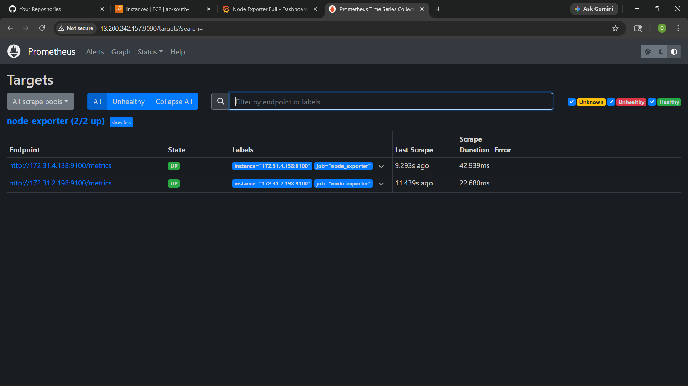
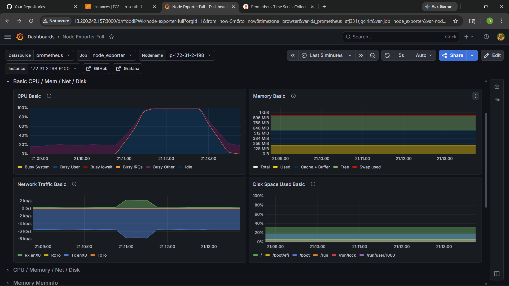
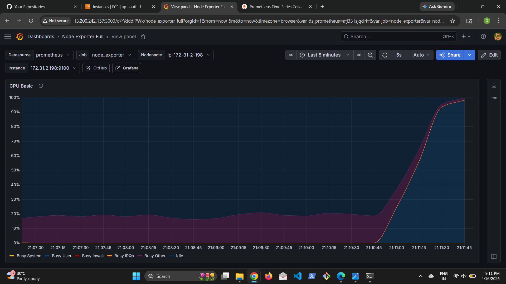
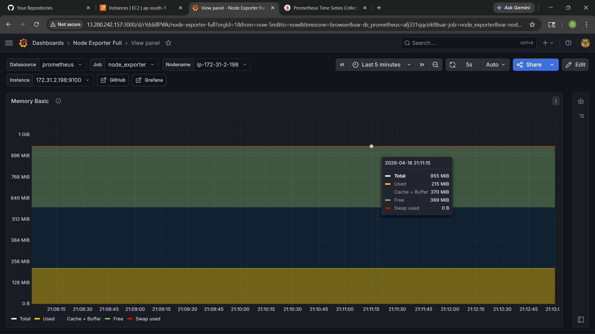
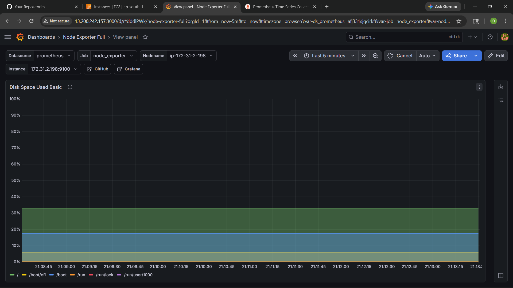
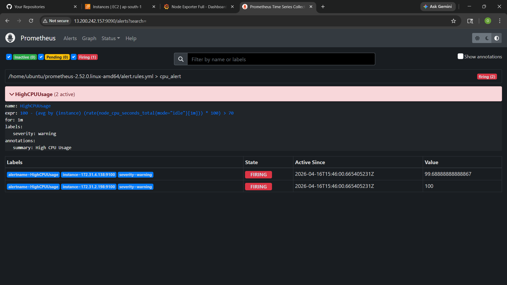

# 🚀 Real-Time Infrastructure Monitoring using Prometheus & Grafana

## 📌 Project Overview

This project implements a real-time monitoring system for EC2 servers using Prometheus and Grafana.

It replaces manual SSH-based monitoring with automated dashboards and alerting.

---

## 🎯 Objectives

* Monitor CPU, Memory, Disk usage
* Visualize metrics in Grafana dashboards
* Trigger alerts when CPU > 70%
* Centralized monitoring server

---

## 🏗️ Architecture

EC2 (Node Exporter) → Prometheus → Grafana Dashboard → Alerts

---

## ⚙️ Technologies Used

* AWS EC2
* Prometheus
* Grafana
* Node Exporter

---

## 🖥️ Setup Steps (Summary)

### 1. Monitoring Server

* Install Prometheus
* Install Grafana

### 2. Application Servers

* Install Node Exporter
* Expose metrics on port 9100

### 3. Prometheus Configuration

* Add EC2 instances in prometheus.yml

### 4. Grafana Setup

* Add Prometheus as data source
* Import dashboards

### 5. Alert Configuration

* Create alert rule for CPU > 70%

---

## 📊 Screenshots

### 🔹 Prometheus Targets

### 🔹 Grafana Dashboard

### 🔹 CPU Usage

### 🔹 Memory Usage

### 🔹 Disk Usage

### 🔹 Alert Triggered

---

## 🚨 Alert Logic

Alert triggers when:
CPU usage > 70% for 1 minute

---

## ✅ Outcome

* Real-time monitoring implemented
* Alerting system working
* Reduced manual effort

---

## 📌 Author

Onkar Shinde
